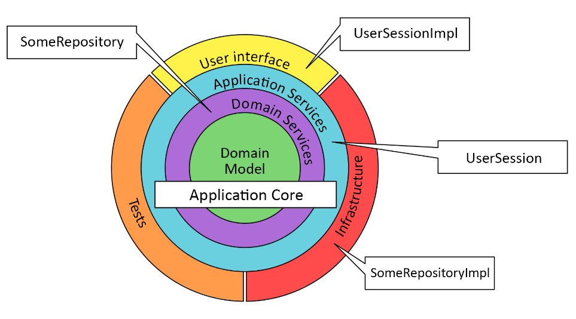

# Onion




## TypeScript Project References

[Project References](https://www.typescriptlang.org/docs/handbook/project-references.html)

```json
{
  // ...
  "references": [
    {
      "@wolksoftware/domain_model": "./src/0_domain_model",
      "@wolksoftware/domain_services": "./src/1_domain_services",
      "@wolksoftware/app_services": "./src/2_app_services",
      "@wolksoftware/infrastructure/http": "./src/3_infrastructure/http",
      "@wolksoftware/infrastructure/dal": "./src/3_infrastructure/dal",
      "@wolksoftware/infrastructure/ioc": "./src/3_infrastructure/ioc"
    }
  ]
}
```
